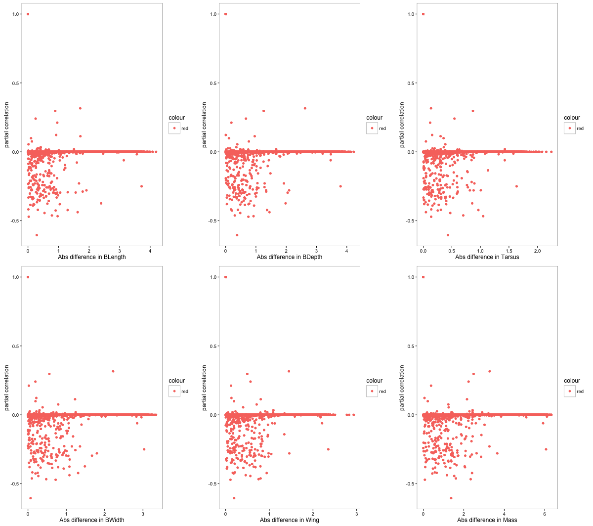
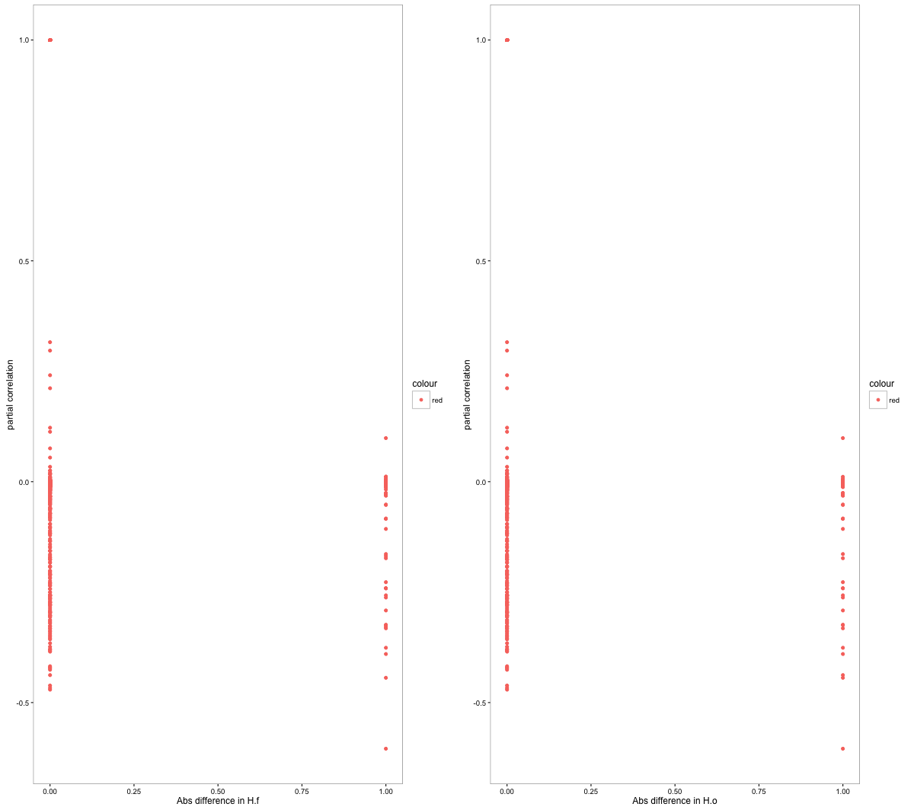

## Overview

We applied Graphical LASSO on the bird species and environmental variables jointly to identiy causal relationships among bird species and between bird species and environmental variables. It was found that a large number of bird species have negative causal relationship among each other. We would want to investigate if this negative relationship has something to do with morphological, diet or habitat features of these bird species.  

## Data Preparation

```{r warning=FALSE, message=FALSE}
library(HimalayanBirdsAbundance)
data("HimalayanBirdsAbundance")
new_counts <- t(exprs(HimalayanBirdsAbundance));
metadata <- pData(HimalayanBirdsAbundance);

elevation_metadata=metadata$Elevation;
east_west_dir = metadata$WorE;

morph <- read.csv(file = "../external_data/MorphEco.csv", header = T, row.names =1)

morph <- morph[as.vector(colnames(new_counts)),]
morph.log <- log(morph[,1:6])
morph.eco <- morph[,7:20]
morph <- cbind(morph.log, morph.eco)

morph.pc <- prcomp(morph, center=T, scale=T)
```


## Build the causal correlation matrix

```{r echo=TRUE, eval=TRUE, warning=FALSE, message=FALSE}
new_counts <- new_counts[, which(colSums(new_counts)!=0)]
voom_counts <- limma::voom(new_counts)$E;

env.variables <- metadata[,5:8];
pooled_data <- cbind(voom_counts, env.variables);

cov_features <- cov(pooled_data)

system.time(glasso_out <-glasso::glasso(cov_features, rho=.01))

library(network)
glasso_out$wi.cor <- cov2cor(glasso_out$wi);
source("../R/ash_cor.R")
glasso_out$wi.cor.shrunk <- ash_cor(glasso_out$wi.cor, nsamples=309);
glasso_out$wi.cor.shrunk[which(abs(glasso_out$wi.cor.shrunk) < 0.001)]=0;
row.names(glasso_out$wi.cor.shrunk) <- colnames(cov_features);

glasso_out$wi.cor.shrunk.birds <- glasso_out$wi.cor.shrunk[1:305,1:305];

morph_filtered <- morph[match(rownames(glasso_out$wi.cor.shrunk.birds), rownames(morph)),]

```


```{r}
# Multiple plot function
#
# ggplot objects can be passed in ..., or to plotlist (as a list of ggplot objects)
# - cols:   Number of columns in layout
# - layout: A matrix specifying the layout. If present, 'cols' is ignored.
#
# If the layout is something like matrix(c(1,2,3,3), nrow=2, byrow=TRUE),
# then plot 1 will go in the upper left, 2 will go in the upper right, and
# 3 will go all the way across the bottom.
#
multiplot <- function(..., plotlist=NULL, file, cols=1, layout=NULL) {
  library(grid)

  # Make a list from the ... arguments and plotlist
  plots <- c(list(...), plotlist)

  numPlots = length(plots)

  # If layout is NULL, then use 'cols' to determine layout
  if (is.null(layout)) {
    # Make the panel
    # ncol: Number of columns of plots
    # nrow: Number of rows needed, calculated from # of cols
    layout <- matrix(seq(1, cols * ceiling(numPlots/cols)),
                    ncol = cols, nrow = ceiling(numPlots/cols))
  }

 if (numPlots==1) {
    print(plots[[1]])

  } else {
    # Set up the page
    grid.newpage()
    pushViewport(viewport(layout = grid.layout(nrow(layout), ncol(layout))))

    # Make each plot, in the correct location
    for (i in 1:numPlots) {
      # Get the i,j matrix positions of the regions that contain this subplot
      matchidx <- as.data.frame(which(layout == i, arr.ind = TRUE))

      print(plots[[i]], vp = viewport(layout.pos.row = matchidx$row,
                                      layout.pos.col = matchidx$col))
    }
  }
}
```

## Causality versus Morphology

We first explore the causal relationship of abundance patterns among bird species with respect to morphological features such as wing size, beak length etc etc. 

```{r echo=TRUE, eval=FALSE}

morph.dist <- do.call(cbind, lapply(1:dim(morph_filtered)[2],
                     function(l)  {
                    return(as.vector((outer(morph_filtered[,l],morph_filtered[,l],
                    function(x,y) return(abs(x-y))))))
                     }));

dist.data <- cbind.data.frame(morph.dist, as.vector(glasso_out$wi.cor.shrunk.birds));
colnames(dist.data) <- c(paste0(colnames(morph),".dist"), "partialcorr");


g1 <- ggplot2::qplot(BLength.dist, partialcorr, 
               data=dist.data,
               ylab="partial correlation",
               xlab=paste("Abs difference in", colnames(morph_filtered)[1]),
               col="red")

g2 <- ggplot2::qplot(BWidth.dist, partialcorr, 
               data=dist.data,
               ylab="partial correlation",
               xlab=paste("Abs difference in", colnames(morph_filtered)[2]),
               col="red")

g3 <- ggplot2::qplot(BDepth.dist, partialcorr, 
               data=dist.data,
               ylab="partial correlation",
               xlab=paste("Abs difference in", colnames(morph_filtered)[3]),
               col="red")

g4 <- ggplot2::qplot(Wing.dist, partialcorr, 
               data=dist.data,
               ylab="partial correlation",
               xlab=paste("Abs difference in", colnames(morph_filtered)[4]),
               col="red")

g5 <- ggplot2::qplot(Tarsus.dist, partialcorr, 
               data=dist.data,
               ylab="partial correlation",
               xlab=paste("Abs difference in", colnames(morph_filtered)[5]),
               col="red")

g6 <- ggplot2::qplot(Mass.dist, partialcorr, 
               data=dist.data,
               ylab="partial correlation",
               xlab=paste("Abs difference in", colnames(morph_filtered)[6]),
               col="red")

multiplot(g1, g2, g3, g4, g5, g6, cols=3)

```



Next, we consider how the strength of causality depends on primary foraging substrate.

```{r echo=TRUE, eval=FALSE}

p1 <- ggplot2::qplot(PyS.A.dist, partialcorr, 
               data=dist.data,
               ylab="partial correlation",
               xlab=paste("Abs difference in", colnames(morph_filtered)[7]),
               col="red")

p2 <- ggplot2::qplot(PyS.G.dist, partialcorr, 
               data=dist.data,
               ylab="partial correlation",
               xlab=paste("Abs difference in", colnames(morph_filtered)[8]),
               col="red")

p3 <- ggplot2::qplot(PyS.T.dist, partialcorr, 
               data=dist.data,
               ylab="partial correlation",
               xlab=paste("Abs difference in", colnames(morph_filtered)[9]),
               col="red")

p4 <- ggplot2::qplot(PyS.B.dist, partialcorr, 
               data=dist.data,
               ylab="partial correlation",
               xlab=paste("Abs difference in", colnames(morph_filtered)[10]),
               col="red")

p5 <- ggplot2::qplot(PyS.M.dist, partialcorr, 
               data=dist.data,
               ylab="partial correlation",
               xlab=paste("Abs difference in", colnames(morph_filtered)[11]),
               col="red")

p6 <- ggplot2::qplot(PyS.R.dist, partialcorr, 
               data=dist.data,
               ylab="partial correlation",
               xlab=paste("Abs difference in", colnames(morph_filtered)[12]),
               col="red")

multiplot(p1, p2, p3, p4, p5, p6, cols=3)

```


We now perform similar analysis on the diet categories.

```{r echo=TRUE, eval=FALSE}
d1 <- ggplot2::qplot(D.V.dist, partialcorr, 
               data=dist.data,
               ylab="partial correlation",
               xlab=paste("Abs difference in", colnames(morph_filtered)[13]),
               col="red")

d2 <- ggplot2::qplot(D.I.dist, partialcorr, 
               data=dist.data,
               ylab="partial correlation",
               xlab=paste("Abs difference in", colnames(morph_filtered)[14]),
               col="red")

d3 <- ggplot2::qplot(D.S.dist, partialcorr, 
               data=dist.data,
               ylab="partial correlation",
               xlab=paste("Abs difference in", colnames(morph_filtered)[15]),
               col="red")

d4 <- ggplot2::qplot(D.F.dist, partialcorr, 
               data=dist.data,
               ylab="partial correlation",
               xlab=paste("Abs difference in", colnames(morph_filtered)[16]),
               col="red")

d5 <- ggplot2::qplot(D.O.dist, partialcorr, 
               data=dist.data,
               ylab="partial correlation",
               xlab=paste("Abs difference in", colnames(morph_filtered)[17]),
               col="red")

d6 <- ggplot2::qplot(D.N.dist, partialcorr, 
               data=dist.data,
               ylab="partial correlation",
               xlab=paste("Abs difference in", colnames(morph_filtered)[18]),
               col="red")

multiplot(d1, d2, d3, d4, d5, d6, cols=3)

```


Finally the effect of habitat

```{r echo=TRUE, eval=FALSE}
h1 <- ggplot2::qplot(H.f.dist, partialcorr, 
               data=dist.data,
               ylab="partial correlation",
               xlab=paste("Abs difference in", colnames(morph_filtered)[19]),
               col="red")

h2 <- ggplot2::qplot(H.o.dist, partialcorr, 
               data=dist.data,
               ylab="partial correlation",
               xlab=paste("Abs difference in", colnames(morph_filtered)[20]),
               col="red")

multiplot(h1, h2, cols=2)

```



## Strength of causality on Principal Components

We now pick the top 4 PCs based on morphological and ecological features and plot the dependency of the causal behavior among the bird species with these features.

```{r echo=TRUE, eval=FALSE, warning=FALSE, message=FALSE}
morph.pc <- prcomp(morph_filtered, center=T, scale=T)

PC.dist <- do.call(cbind, lapply(1:dim(morph.pc$x)[2],
                     function(l)  {
                    return(as.vector((outer(morph.pc$x[,l],morph.pc$x[,l],
                    function(x,y) return(abs(x-y))))))
                     }));

PC.data.dist <- cbind.data.frame(PC.dist, as.vector(glasso_out$wi.cor.shrunk.birds))
colnames(PC.data.dist) <- c(paste0(colnames(morph.pc$x),".dist"), "partialcorr");

pc1 <- ggplot2::qplot(PC1.dist, partialcorr, 
               data=PC.data.dist,
               ylab="partial correlation",
               xlab=paste("Abs difference in", colnames(morph.pc$x)[1]),
               col="red")

pc2 <- ggplot2::qplot(PC2.dist, partialcorr, 
               data=PC.data.dist,
               ylab="partial correlation",
               xlab=paste("Abs difference in", colnames(morph.pc$x)[2]),
               col="red")

pc3 <- ggplot2::qplot(PC3.dist, partialcorr, 
               data=PC.data.dist,
               ylab="partial correlation",
               xlab=paste("Abs difference in", colnames(morph.pc$x)[3]),
               col="red")

pc4 <- ggplot2::qplot(PC4.dist, partialcorr, 
               data=PC.data.dist,
               ylab="partial correlation",
               xlab=paste("Abs difference in", colnames(morph.pc$x)[4]),
               col="red")

multiplot(pc1, pc2, pc3, pc4, cols=2)


```


